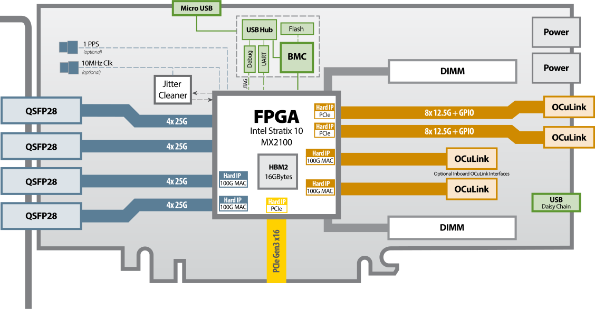
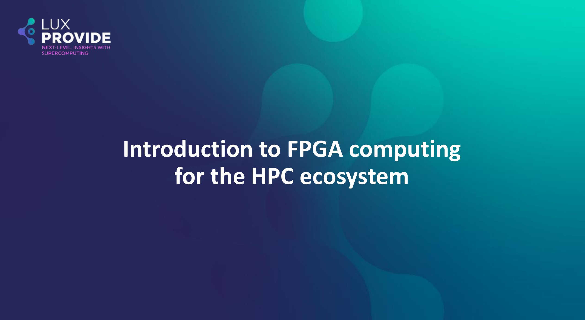

# Introduction to FPGA computing for the HPC ecosystem

## Field Programmable Gate Array (FPGA) 

An FPGA (Field-Programmable Gate Array) is an integrated circuit designed to be configured by the user after manufacturing. It consists of an array of programmable logic blocks and a hierarchy of reconfigurable interconnects, allowing users to create custom digital circuits. FPGAs are known for their flexibility, enabling rapid prototyping and implementation of complex functions in hardware, making them suitable for applications in telecommunications, automotive, aerospace, and various other fields where custom and high-performance computing is needed.

!!! tip "Difference Between FPGA Development Boards and HPC FPGA Cards"
    === "FPGA Development Boards"
        * **Purpose**: Primarily used for prototyping, learning, and development purposes.
        * **Design**: These boards typically come with various interfaces (like HDMI, USB, Ethernet) and peripherals (like buttons, LEDs, and sensors) to facilitate easy testing and development.
        * **Flexibility**: They offer a broad range of input/output options to support diverse projects and experiments.
        * **Cost**: Generally more affordable than HPC FPGA cards due to their focus on versatility and accessibility.
        * **Target Audience**: Suitable for students, hobbyists, and engineers working on initial project phases or small-scale applications.
        * **Specifications**: 
            - Logic Cells: 33,280 
            - Block RAM: 1,800 Kbits
            - External memory: None

        
        

    === "HPC FPGA Cards"
        * **Purpose**: Designed for high-performance computing (HPC) applications, focusing on accelerating compute-intensive tasks.
        * **Design**: Typically more powerful, with higher logic capacity, memory, and bandwidth capabilities. They often come with specialized cooling solutions and are designed to be mounted in server racks.
        * **Performance**: Optimized for tasks such as data center operations, machine learning, financial modeling, and large-scale scientific computations.
        * **Cost**: Generally more expensive due to their advanced features and high-performance capabilities.
        * **Target Audience**: Aimed at professionals in industries requiring significant computational power, such as data scientists, researchers, and engineers in high-performance computing sectors.
        * **Specifications**:
            - Logic Cells: 2,073,000 
            - Block RAM: 239.5 Mb
            - External memory: 16GB HBM2

        

## Parallelism model for FPGA

* FPGA strongly differs from ISA-based hardware such as CPU and GPU

!!! note "Difference between **Instruction Set** architecture and **Spatial** architecture"
    === "Instruction Set Architecture"
        * Made for general-purpose computation: hardware is constantly reused 
        * Workflow constrained by a set of pre-defined units (Control Units, ALUs, registers)
        * Data/Register size are fixed
        * Different instruction executed in each clock cycle : **temporal** execution  
        

    === "Spatial Architecture"
        * Keep only what it needs -- the hardware can be reconfigured
        * Specialize the everything by unrolling the hardware: **spatial** execution
        * Each operation uses a different hardware region
        * The design can take more space than the FPGA offers 

        { width=90% }

* The most obvious source of **parallelism** for FPGA is **pipelining** by inserting registers to store each operation output and keep all hardware unit busy. 

* Pipelining parallelism has therefore many stages. 

* If you don't have enough work to fill the pipeline, then the efficiency is very low.

* The authors of the [DPC++ book](https://link.springer.com/book/10.1007/978-1-4842-5574-2) have illustrated it perfectly in Chapter 17.

!!! note "Pipelining example provided chap.17 (DPC++ book)"
    === "Processing a single element (Figure. 17-13)"
        

        * The pipeline is mostly empty.
        * Hardware units are not busy and the efficiency is thus low.
            

    === "Taking advantage of pipelining (Figure 17-14)"
        

        * More data than stages, the pipeline is full and all hardware units are busy.

!!! warning "Vectorization"
    Vectorization is not the main source of parallelism but help designing efficient pipeline. Since hardware can be reconfigured at will. The offline compiler can design N-bits Adders, multipliers which simplify greatly vectorization. In fact, the offline compiler vectorizes your design automatically if possible.

### Pipelining with ND-range kernels

* ND-range kernels are based on a hierachical grouping of work-items
* A work-item represents a single unit of work 
* Independent simple units of work don't communicate or share data very often
* Useful when porting a GPU kernel to FPGA

<figure markdown>
 
  <figcaption><a href=https://link.springer.com/book/10.1007/978-1-4842-5574-2>DPC++ book</a> -- Figure 17-15 </figcaption>
</figure>

* FPGAs are different from GPU (lots of thread started at the same time)
* Impossible to replicate a hardware for a million of work-items
* Work-items are injected into the pipeline
* A deep pipeline means lots of work-items executing different tasks in parallel

<figure markdown>

  <figcaption><a href=https://link.springer.com/book/10.1007/978-1-4842-5574-2>DPC++ book</a> -- Figure 17-16 </figcaption>
</figure>

### Pipelining with single-work item (loop)

* When your code can't be decomposed into independent works, you can rely on loop parallelism using FPGA
* In such a situation, the pipeline inputs is not work-items but loop iterations
* For single-work-item kernels, the programmer need not do anything special to preserve the data dependency 
* Communications between kernels is also much easier

<figure markdown>

  <figcaption><a href=https://link.springer.com/book/10.1007/978-1-4842-5574-2>DPC++ book</a> -- Figure 17-21 </figcaption>
</figure>

* FPGA can efficiently handle loop execution, often maintaining a fully occupied pipeline or providing reports on what changes are necessary to enhance occupancy.
* It's evident that if loop iterations were substituted with work-items, where the value created by one work-item would have to be transferred to another for incremental computation, the algorithm's description would become far more complex.

## MeluXina Bittware 520N-MX FPGAS

Each of the 20 MeluXina FPGA compute nodes comprise two **BittWare 520N-MX** FPGAs based on the [**Intel Stratix 10 FPGA chip**](https://www.intel.com/content/www/us/en/products/details/fpga/stratix/10/docs.html). Designed for compute acceleration, the 520N-MX are PCIe boards featuring Intel’s Stratix 10 MX2100 FPGA with integrated HBM2 memory. The size and speed of HBM2 (16GB at up to 512GB/s) enables acceleration of memory-bound applications. Programming with high abstraction C, C++, and OpenCLis possible through an specialized board support package (BSP) for the Intel OpenCL SDK. For more details see the dedicated [BittWare product page](https://www.bittware.com/fpga/520n-mx/).

{: style="height:250px;width:"}

Intel Stratix 520N-MX Block Diagram.

The Bittware 520N-MX cards have the following specifications:

1. **FPGA**: Intel Stratix 10 MX with MX2100 in an F2597 package, 16GBytes on-chip High Bandwidth Memory (HBM2) DRAM, 410 GB/s (speed grade 2).
2. Host interface:    x16 Gen3 interface direct to FPGA, connected to PCIe hard IP.
3. Board Management Controller
    * FPGA configuration and control
    * Voltage, current, temperature monitoring
    * Low bandwidth BMC-FPGA comms with SPI link
4. Development Tools
    * Application development: supported design flows - Intel FPGA OpenCL SDK, Intel High-Level Synthesis (C/C++) & Quartus Prime Pro (HDL, Verilog, VHDL, etc.)
    * FPGA development BIST - Built-In Self-Test with source code (pinout, gateware, PCIe driver & host test application)

The FPGA cards are not directly connected to the MeluXina ethernet network. The FPGA compute nodes are linked into the high-speed (infiniband) fabric, and the host code can communicate over this network for distributed/parallel applications.

More details on FPGA can be found in the presentation below:

