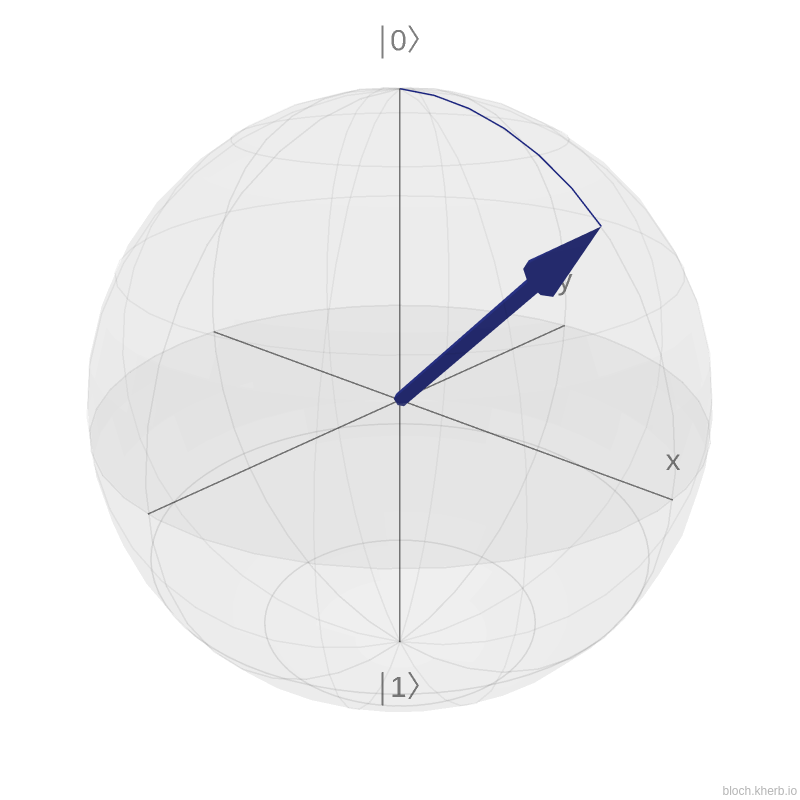
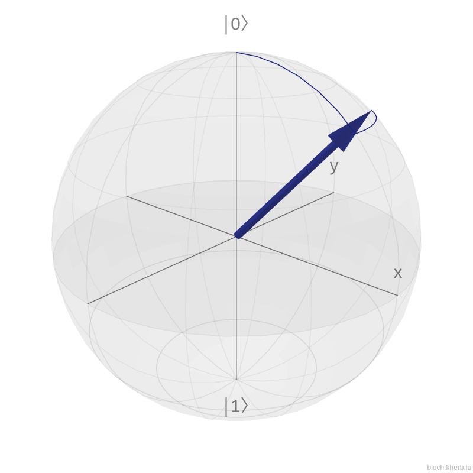

* At this point, we have shown how to implement a simple circuit with two types of gates

* Nonetheless, with this two gates, we can't model complex circuits
 
* We need something more **universal** 

## Introduction to the Bloch Sphere

* All states of a qubit $|\psi\rangle$ can be drawn on the surface of an sphere. We can show it by going back to the defintion of a single qubit: $|\psi\rangle = \alpha|0\rangle + \beta|1\rangle$

* We know that $\alpha, \beta \in \mathbb{C}$ which means that $\alpha=r_1e^{i\gamma_1}$ and $\beta=r_2e^{i\gamma_2}$

* By Observing that $|\alpha|^2 + |\beta|^2 = r_1^2 + r_2^2 = 1$ and $0\leq r_1 \leq 1$, $0\leq r_2 \leq 1$, we can therefore use the following change of variable: $r_1=cos(\frac{\theta}{2})$ and $r_2=sin(\frac{\theta}{2})$


$$
\begin{aligned}
                              |\psi\rangle & = cos\frac{\theta}{2}e^{i\gamma_1}|0\rangle + sin\frac{\theta}{2}e^{i\gamma_2}|1\rangle
\end{aligned}
$$


* We can simplify this expression by noting that $|\psi\rangle$ can be multiplied by any complex number or **global phase** $z$ with $|z|=1$ without changing its state

* Let's take $z=e^{-i\gamma_1}$ as **global phase**:

$$
\begin{aligned}
                              e^{-i\gamma_1}|\psi\rangle & = cos\frac{\theta}{2}|0\rangle + sin\frac{\theta}{2}e^{i\gamma_2-\gamma_1}|1\rangle
                                                         & = cos\frac{\theta}{2}|0\rangle + sin\frac{\theta}{2}e^{i\sigma}|1\rangle
\end{aligned}
$$

* With $\theta$ and $\sigma$, representing respectively, the polar angle and an azimuthal angle. 

{width=350}
{width=350}
$$
                              \theta=\frac{\pi}{4};\sigma=0 \hspace{5cm} \theta=\frac{\pi}{4};\sigma=\frac{\pi}{4} 
$$

!!! warning
    If you did not already guess it, the Pauli X, Y and Z gates are rotations around their respective axis. The X gate transform $|0\rangle$ to $|1\rangle$ which corresponds to $\pi$ rotation 


* More general rotation operators are generated by exponentiation of the Pauli matrices, i.e., $e^{iAx} = cos(x)I+isin(x)A$ 

    - The rotation around the $X$ axis: $R_X(\theta)=e^{-i\frac{\theta}{2}X}=\begin{pmatrix}cos\frac{\theta}{2} & -isin\frac{\theta}{2} \\\\ -isin\frac{\theta}{2} & cos\frac{\theta}{2}\end{pmatrix}$
    - The rotation around the $Y$ axis: $R_Y(\theta)=e^{-i\frac{\theta}{2}Y}=\begin{pmatrix}cos\frac{\theta}{2} & -sin\frac{\theta}{2} \\\\ sin\frac{\theta}{2} & cos\frac{\theta}{2}\end{pmatrix}$
    - The rotation around the $Z$ axis: $R_Z(\theta)=e^{-i\frac{\theta}{2}Z}=\begin{pmatrix}1 & 0 \\\\ 0 & e^{i\theta}\end{pmatrix}$


## Implementing the rotation gates

!!! tig "Rotations gates"
    === "Question"
        - Implement the 3 Rotation gates Rx, Ry and Rz
        !!! info "Building and the code"  
            ```bash
            mkdir build-rotation-gates && cd build-rotation-gates
            cmake ..
            make fpga
            LD_PRELOAD=${JEMALLOC_PRELOAD} ./quantum.fpga
            ```

    === "Solution"
        - Add the following code in the `#!cpp void h(...)` function body
        ```cpp linenums="1"
        std::complex<float> A (1.0f,0.0f);
        std::complex<float> B (1.0f,0.0f);
        std::complex<float> C (1.0f,0.0f);
        std::complex<float> D (-1.0f,0.0f);
        apply_gate(queue,stateVector_d,std::pow(2,numQubits)/2,target,A/std::sqrt(2.0f),
                                                                  B/std::sqrt(2.0f),
                                                                  C/std::sqrt(2.0f),
                                                                  D/std::sqrt(2.0f));
        ```
