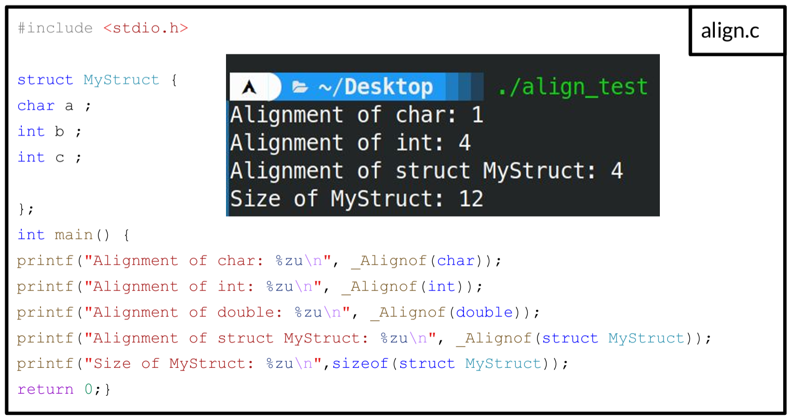
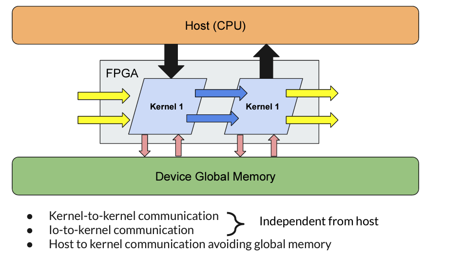

# Optimizing SYCL programs for Intel® FPGA cards

Optimizing SYCL code for Intel FPGAs requires a combination of understanding the FPGA hardware, the SYCL programming model, and the specific compiler features provided by Intel. Here are some general guidelines to optimize Intel FPGA SYCL code.

Compared to OpenCL, the Intel® oneAPI DPC++ compiler has enhanced features to detect possible optimizations( vectorization, static coalescing, etc ...). Nonetheless, some rules need to be followed to make sure the compiler is able to apply these optimizations. 

!!! warning "Optimizing your design"
    As this course/workshop is only an introduction to the Intel® oneAPI for FPGA programming, we can't unfortunately provide all existing and possible optimizations. Many more optimizations can be found in the Intel official documentation.

## Loop optimization

Loop unrolling is an optimization technique that aims to increase parallelism and, consequently, the throughput of certain computational tasks, particularly when implemented in hardware environments such as FPGAs. 


1. **Pipelining Synergy**: Loop unrolling often goes hand in hand with pipelining in FPGAs. When loops are unrolled, each unrolled iteration can be pipelined, leading to even greater throughput enhancements.

2. **Resource Utilization**: While loop unrolling can significantly speed up operations, it also consumes more FPGA resources, like Logic Elements (LEs) and registers, because of the duplicated hardware. Hence, there's a trade-off between speed and resource utilization.

3. **Memory Access**: Unrolling loops that involve memory operations can lead to increased memory bandwidth utilization. In cases where memory bandwidth is a bottleneck, unrolling can provide substantial performance improvements.

4. **Latency & Throughput**: Loop unrolling doesn't necessarily reduce the latency of a single loop iteration (the time taken for one iteration to complete), but it can significantly improve the throughput (number of completed operations per unit time).


5. **Reduction in Control Logic**: Unrolling can reduce the overhead associated with the loop control logic, such as incrementing the loop counter and checking the loop termination condition.

    <figure markdown>
        
       <figcaption>[Loop Optimization in HLS](https://www.zzzdavid.tech/loop_opt/)</figcaption>
    </figure>

* Unrolling loops will help to reduce the Initialization Interval (II) as you can notice on the previous figure.

!!! tig "Increasing throughput with loop unrolling"
    === "How to unroll loops"
        * Unrolling loop can be done using the `#pragma unroll <N>`
        * `<N>` is the unroll factor
        * `#pragma unroll 1` : prevent a loop in your kernel from unrolling
        * `#pragma unroll` : let the offline compiler decide how to unroll the loop 
        ```cpp
        handler.single_task<class example>([=]() {
            #pragma unroll
                for (int i = 0; i < 10; i++) {
                    acc_data[i] += i;
                }
            #pragma unroll 1
            for (int k = 0; k < N; k++) {
                #pragma unroll 5
                for (int j = 0; j < N; j++) {
                    acc_data[j] = j + k;
                }
            }
        });
        ```

    === "Question"
        * Consider the following code that you can find at `oneAPI-samples/DirectProgramming/C++SYCL_FPGA/Tutorials/Features/loop_unroll`
        * Note that Intel did not consider data alignment which could impact performance
        * We included `#include <boost/align/aligned_allocator.hpp>` to create aligned std::vector
        * The following SYCL code has been already compiled for you, execute it on the FPGA nodes for several data input size and record the throughput and kernel time
        * What do you observe ?
        ```cpp linenums="1"
        --8<-- "./code/09-loop_unroll/src/loop_unroll.cpp"
        ```
    === "Solution"

        <div align="center">

        | Unroll factor   | kernel execution time (ms)   | Throughput (GFlops) |
        |:---------------:|:----------------------------:|:-------------------:|
        |       1         |             77               |        0.447        |
        |       2         |             58               |        0.591        |
        |       4         |             43               |        0.804        |
        |       8         |             40               |        0.857        |
        |       16        |             39               |        0.882        |

        </div>

        * Increasing the unroll factor improves throughput    
        * Nonetheless, unrolling large loops should be avoided as it would require a large amount of hardware
        !!! warning "Recording kernel time"
            * In this example, we have also seen how to record kernel time.
            * Using the property `property::queue::enable_profiling{}`` adds the requirement that the runtime must capture profiling information for the command groups that are submitted from the queue 
            * You can the capture  the start & end time using the following two commands:
                - `double start = e.get_profiling_info<info::event_profiling::command_start>();`
                - `double end = e.get_profiling_info<info::event_profiling::command_end>();`

!!! warning "Caution with nested loops"
    * Loop unrolling involves replicating the hardware of a loop body multiple times and reducing the trip count of a loop. Unroll loops to reduce or eliminate loop control overhead on the FPGA. 
    * Loop-unrolling can be used to eliminate nested-loop structures.
    * However avoid unrolling the outer-loop which will lead to **Resource Exhaustion** and dramatically increase offline compilation

## SIMD Work Items for ND-Range kernels

* In the [Reporting & Profiling](./reporting_profiling.md#example) section we have seen that vectorization can improve bandwidth

* ND-range kernel should use instead of classical data-parallel kernels
* The work-group size needs to be set using the attribute `[[sycl::reqd_work_group_size(1, 1, REQD_WG_SIZE)]]`
* To specify the number of SIMD work_items, you will need to add the following attribute `[[intel::num_simd_work_items(NUM_SIMD_WORK_ITEMS)]]`
* Note that **NUM_SIMD_WORK_ITEMS** should divide evenly **REQD_WG_SIZE**
* The supported values for **NUM_SIMD_WORK_ITEMS**  are 2, 4, 8, and 16

!!! example "Example"
    ```cpp linenums="1"
    ...
    h.parallel_for<VectorAddID>(
    sycl::nd_range<1>(sycl::range<1>(2048), sycl::range<1>(128)),        
        [=](sycl::nd_item<1> it) 
        [[intel::num_simd_work_items(8),
        sycl::reqd_work_group_size(1, 1, 128)]] {
        auto gid = it.get_global_id(0);
        accessor_c[gid] = accessor_a[gid] + accessor_b[gid];
        });
    });
    ...
    ```

    * The **128** work-items are evenly distributed among **8** SIMD lanes

    * 128/8 = 16 wide vector operation

    * The offline compiler coalesces 8 loads to optimize (reduce) the access to memory in case there are no data dependencies


## Loop coalescing

Utilize the `loop_coalesce` attribute to instruct the Intel® oneAPI DPC++/C++ Compiler to merge nested loops into one, preserving the loop's original functionality. By coalescing loops, you can minimize the kernel's area consumption by guiding the compiler to lessen the overhead associated with loop management.

!!! example "Coalesced two loops"
    === "Using the loop_coalesce attribute"
    ```cpp
    [[intel::loop_coalesce(2)]]
    for (int i = 0; i < N; i++)
       for (int j = 0; j < M; j++)
          sum[i][j] += i+j;
    ```
    === "Equivalent code"
    ```cpp
    int i = 0;
    int j = 0;
    while(i < N){
      sum[i][j] += i+j;
      j++;
      if (j == M){
        j = 0;
        i++;
      }
    }
    ```


## Ignore Loop-carried dependencies

The **ivdep** attribute in Intel's oneAPI (as well as in other Intel compiler tools) is used to give a hint to the compiler about the independence of iterations in a loop. This hint suggests that there are no loop-carried memory dependencies that the compiler needs to account for when attempting to vectorize or parallelize the loop.

When you use **ivdep**, you're essentially telling the compiler: "Trust me, I've reviewed the code, and the iterations of this loop do not have dependencies on each other. So, you can safely vectorize or parallelize this loop for better performance."

!!! example "ivdep attribute"
    ```cpp
    #pragma ivdep
    for (int i = 1; i < N; i++) {
        A[i] = A[i - 1] + B[i];
    }
    ```
!!! warning "Caution"
    You should be very careful when using **ivdep**. Incorrectly using this pragma on a loop that does have dependencies can lead to unexpected results or undefined behavior. Always ensure that there are truly no dependencies in the loop before applying this hint.

## Memory 

### Static coalescing

* Static coalescing is performed by the Intel® oneAPI DPC++/C++ Compiler contiguous accesses to global memory can be merged into a single wide access.

* For static memory coalescing to occur, your code should be structured so that the compiler can detect a linear access pattern at compile time. The initial kernel code depicted in the previous figure can leverage static memory coalescing, as all indices into buffers a and b increase with offsets recognizable during compilation.


<figure markdown>

  <figcaption><a href=https://www.intel.com/content/www/us/en/docs/oneapi-fpga-add-on/optimization-guide/2023-1/static-memory-coalescing.html>FPGA Optimization Guide for Intel® oneAPI Toolkits</a> -- Figure 17-21 </figcaption>
</figure>

### Data structure alignment

In order to performance, structure alignment can be modified to be properly aligned. By default, the offline compiler aligns these elements based on:

* The alignment should be a power of two.
* The alignment should be a multiple of the least common multiple (LCM) of the word-widths of the structure member sizes.

Let's take a simple but clear example to understand why alignment is so important.



!!! example "Removing padding and changing structure alignment"
    === "Code"
    
        * The following code show the impact of changing the alignmement and padding using three scenarii:

             * Default alignment and padding 

             * Removing padding

             * Changing alignment 

        ```cpp linenums="1"
        --8<-- "./code/10-alignment/src/alignment.cpp"
        ```
    === "Execution time"

        <div align=center>

        | Scenario                      | Processing time (seconds)  |
        |: ---------------------------: | :-------------------------:|
        | Default alignment and padding | 14.33                      |
        | Removing padding              | 6.35                       |
        | Changing alignment            | 0.03                       |

        </div>


### Local memory

#### Local memory in ND-Range kernels

* You can improve memory access by using local and private memory.
* When you define a private array, group local memory, or a local accessor, the Intel® oneAPI DPC++/C++ Compiler generates kernel memory in the hardware. This kernel memory is often termed on-chip memory since it originates from memory resources, like RAM blocks, present on the FPGA.
* Local or private memory is a fast memory that should be favored when resources allow.

!!! example "Private memory"
    ```cpp linenums="1"
    ...
    q.submit([&](handler &h) {
    // Create an accessor for device global memory from buffer buff
    accessor acc(buff, h, write_only);
    cgh.single_task([=]() {
         // Declare a private array
         int T[N];
         // Write to private memory
         for (int i = 0; i < N; i++)
            T[i] = i;
         // Read from private memory and write to global memory through the accessor
         for (int i = 0; i < N; i+=2)
            acc[i] = T[i] + T[i+1];
         });
    }); 
    ...
    ```
* To set aside local memory that can be accessed and shared by every work item within a workgroup, establish a group-local variable within the function scope of a workgroup. Do this using the group_local_memory_for_overwrite function, illustrated in the subsequent example:

!!! example "Local memory"
    ```cpp linenums="1"
    ...
    q.submit([&](handler &h) {
        h.parallel_for(
            nd_range<1>(range<1>(256), range<1>(16)), [=](nd_item<1> item) {
            int local_id = item.get_local_id();
            auto ptr = group_local_memory_for_overwrite<int[16]>(item.get_group());
            auto& ref = *ptr;
            ref[local_id] = local_id++ ;
            });
        });
    ... 
    ```

    * The ND-Range kernel has 16 workgroups with 16 work items for each group.
    * A group-local variable (int[16]) is created for each group and shared through a multi_ptr to all work-items of the same group

#### Settings memory banks

* Local data can be stored  in separate  local memory banks for parallel memory accesses
* Number of banks of a local memory can be adjusted (e.g., to increase the parallel access) 
* Add the following attributes `[[intel::numbanks(#NB), intel::bankwidth(#BW)]]`:  
    * `#NB` : number of banks 
    * `#BW`: bankwidth to be considered 
* Ex: `[[intel::numbanks(8), intel::bankwidth(16)]]lmem[8][4]`; 
    * No two element can be accessed in parallel in lmem 
    * Single bank local memory 
* All rows accessible in parallel with numbanks(8) 
* Different configurations patterns can be adopted 


!!! warning "Masking the last index"
    * Intel's documentation states that "To enable parallel access, you must mask the dynamic access on the lower array index"
    ```cpp linenums="1"
    [[intel::numbanks(8), intel::bankwidth(16)]] int lmem[8][4];
    #pragma unroll
    for (int i = 0; i < 4; i+=2) {
        lmem[i][x & 0x3] = ...;
    } 
    ```
!!! tig "Exercice"
    === "Question"
        * Could you briefly describe the bank configuration of the following local memory declaration;
        ```cpp
         [[intel::numbanks(4),intel::bankwidth(8)]] int lmem[2][4];
        ```
    === "Solution"
        

#### Local memory replication

!!! example "Example"
    <div style="position:relative;">
    <div style="display:inline-block; width:50%;">
    ```cpp linenums="1"
    [[intel::fpga_memory,
    intel::singlepump,
    intel::max_replicates(3)]] int lmem[16]; 
    lmem[waddr] = lmem[raddr] +
                  lmem[raddr + 1] +
                  lmem[raddr + 2]; 
    ```

    * The offline compiler can replicate the local memory
    * This allows to create multiple ports 
    * Behaviour: 
        * All read ports will be accessed in parallel 
        * All write ports are connected together
        * Data between replicate is identical 
    * Parallel access to all ports is possible but consumes more hardware resources
    * `[[intel::max_replicates(N)]]` control the replication factor


    </div>
    <div style="display:inline-block; width:50%;float:right;">
    { align=right width=300 }
    </div>
    </div>

## Task parallelism with Inter-Kernel Pipes



Pipes function as a first-come, first-served buffer system, linking different parts of a design. The Intel® oneAPI DPC++/C++ Compiler offers various pipe types:

* **Host Pipes**: These establish a connection between a host and a device.

* **Inter-Kernel Pipes**: These facilitate efficient and low-latency data transfer and synchronization between kernels. They enable kernels to interact directly using on-device FIFO buffers, which utilize FPGA memory. The Intel® oneAPI DPC++/C++ Compiler promotes simultaneous kernel operation. By employing inter-kernel pipes for data movement among concurrently running kernels, data can be transferred without waiting for a kernel to finish, enhancing your design's throughput.

* **I/O Pipes**: This is a one-way connection to the hardware, either as a source or sink, which can be linked to an FPGA board's input or output functionalities. Such functionalities could encompass network interfaces, PCIe®, cameras, or other data acquisition or processing tools and protocols.


### Inter-Kernel Pipes


* We will only focus on Inter-Kernel Pipes to leverage task parallelism
* As for OpenCL programming, pipes can be blocking or non-blocking
* For Intel® oneAPI with FPGA, you need to include FPGA extension:
```cpp
#include <sycl/ext/intel/fpga_extensions.hpp>
```

!!! example "Pipe creation and usage"
    === "Blocking pipes"
        ```cpp linenums="1"
        // Using alias eases considerably their usage
        using my_pipe = ext::intel::pipe<      
                        class InterKernelPipe, // An identifier for the pipe.
                        int,                   // The type of data in the pipe.
                        4>;                    // The capacity of the pipe.

        // Single_task kernel 1
        q.submit([&](handler& h) {
            auto A = accessor(B_in, h);
            h.single_task([=]() {
                for (int i=0; i < count; i++) {
                    my_pipe::write(A[i]); // write a single int into the pipe
                    
                }
            });
        }); 

        // Single_task kernel 2
        q.submit([&](handler& h) {
            auto A = accessor(B_out, h);
            h.single_task([=]() {
                for (int i=0; i < count; i++) {
                    A[i] = my_pipe::read(); // read the next int from the pipe
                }
            });
        }); 
        ```

    === "Non-Blocking pipes"
        ```cpp linenums="1"
        // Using alias eases considerably their usage
        using my_pipe = ext::intel::pipe<      
                        class InterKernelPipe, // An identifier for the pipe.
                        int,                   // The type of data in the pipe.
                        4>;                    // The capacity of the pipe.

        // Single_task kernel 1
        q.submit([&](handler& h) {
            auto A = accessor(B_in, h);
            h.single_task([=]() {
                valid_write = false;
                for (int i=0; i < count; i++) {
                    my_pipe::write(A[i],valid_write); // write a single int into the pipe

                }
            });
        }); 

        // Single_task kernel 2
        q.submit([&](handler& h) {
            auto A = accessor(B_out, h);
            h.single_task([=]() {
                valid_read = false;
                for (int i=0; i < count; i++) {
                    A[i] = my_pipe::read(valid_read); // read the next int from the pipe
                }
            });
        }); 
        
        ```

!!! warning "Stalling pipes"
    * Care should be taken when implementing pipes, especially when there is a strong imbalance between the consumer kernel reading from the pipe and the producer kernel that feed the pipe. 
    * Stalling pipes can be disastrous when using blocking pipes


