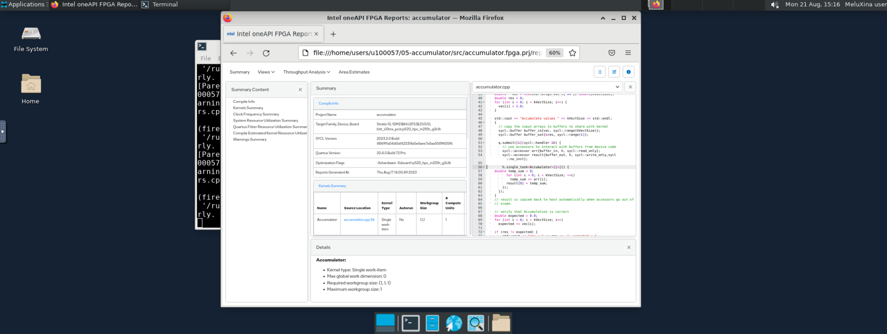

# Reporting & Profiling SYCL programs for Intel® FPGA cards

After having spent some time to write your kernel and debug functional problems, it's now time to take advantage of the accelerator. FPGA uses **pipelining parallelism** but how does it work ? 


## Definitions


!!! abstract "Pipelining (see FPGA Optimization Guide for Intel® oneAPI Toolkits)"
    Pipelining is a design technique used in synchronous digital circuits to increase fMAX. Pipelining involves
    adding registers to the critical path, which decreases the amount of logic between each register. Less logic
    takes less time to execute, which enables an increase in fMAX.
    The critical path in a circuit is the path between any two consecutive registers with the highest latency. That
    is, the path between two consecutive registers where the operations take the longest to complete.
    Pipelining is especially useful when processing a stream of data. A pipelined circuit can have different stages
    of the pipeline operating on different input stream data in the same clock cycle, which leads to better data
    processing throughput.
    


!!! abstract "Maximum Frequency (fMAX)"
    The **fMAX** of a digital circuit is its highest possible clock frequency, determining the maximum rate for updating register outputs. This speed is constrained by the physical propagation delay of the signal across the combinational logic between consecutive register stages. The delay is affected by the complexity of the combinational logic in the path, and the path with the greatest number of logic elements and highest delay sets the speed limit for the entire circuit, often known as the **critical path**. The fMAX is the reciprocal of this critical path delay, and having a high fMAX is desirable as it leads to better performance when there are no other restrictions.
    


!!! abstract "Throughput"
    **Throughput** in a digital circuit refers to the speed at which data is handled. When there are no other limiting factors, a higher fMAX leads to increased throughput, such as more samples per second. Often synonymous with performance, throughput is frequently used to gauge the effectiveness of a circuit.
    

!!! abstract "Latency"
    **Latency** measures the duration to complete operations in a digital circuit, and it can be assessed for individual tasks or the whole circuit. It can be measured in time units like microseconds or clock cycles, with the latter often preferred. Measuring latency in clock cycles separates it from the circuit's clock frequency, making it easier to understand the real effects of modifications on the circuit's performance.
    

!!! abstract "Occupancy"
    The **occupancy** of a datapath at a specific moment signifies the fraction of the datapath filled with valid data. When looking at a circuit's execution of a program, the occupancy is the mean value from the beginning to the end of the program's run. Parts of the datapath that are unoccupied are commonly called bubbles, akin to a CPU's no-operation (no-ops) instructions, which don't influence the final output. Minimizing these bubbles leads to greater occupancy. If there are no other hindrances, optimizing the occupancy of the datapath will boost throughput.
    <figure markdown>
        
       <figcaption>Occupancy: 2/5=40%</figcaption>
    </figure>

## Reporting

If you instruct the DPC++ compiler to stop compiling the design after generating the early image, you will be able to access precious information including performance and area estimates without having to wait many hours.
The FPGA Early Image can be analyzed using the FPGA Optimization Report to provide:

* loop analysis
* area estimates
* kernel memory information 
* scheduler information

* Recall that the FPGA Early image can be obtained using the command: `icpx -fsycl -fintelfpga -qactypes -Xshardware -fsycl-link=early -Xsboard=p520_hpc_m210h_g3x16 accumulator.cpp -o accumulator_report.a`

* You can evaluate whether the estimated kernel performance data is satisfactory by going to the <project_dir>/reports/ directory and examining one of the following files related to your application:

1. `report.html`: This file can be viewed using Internet browsers of your choice
2. `<design_name>.zip`: Utilize the Intel® oneAPI FPGA Reports tool,i.e., `fpga_report`

!!! tig "Analyzing the FPGA Early Image report"
    === "accumulator.cpp"
        ```cpp linenums="1"
        --8<-- "./code/05-accumulator/src/accumulator.cpp"
        ```
    === "Setup"
        * First,copy the `accumulator.cpp` to  your home folder    
        * Generate the early image with the report using:
         ```bash
           # Don't forget to be on a node first
           icpx -fsycl -fintelfpga -qactypes -Xshardware -fsycl-link=early -Xsboard=p520_hpc_m210h_g3x16 accumulator.cpp -o accumulator_report.a`
         ```
         * The next step is to download the HTML report located inside the `accumulator_report.prj/reports` directory on local machine
         * Open the file `report.html` with a web browser

         

    === "Question"
        * Check the loop analysis report. What do you observe ?
        * What is the predicted fMAX ?
        * What is the block scheduled II ? What is its impact ? 
    === "Solution"
        * We have a data-dependency at line 59
        * For each loop iteration, the Intel® oneAPI DPC++/C++ Compiler takes 3 cycles to compute the result of the addition and then stores it in the variable temp_sum
        * We either need to remove the data dependency or to relax it

## Profiling

* The Intel® FPGA dynamic profiler for DPC++ can be used to add **performance counters** to the design and collect performance data during execution. This requires full hardware compilation.
* In order to instruct the offline compiler to add those performance counters, one needs to add the compilation option `-Xsprofile`.

<figure markdown>

  <figcaption><a href=https://www.intel.com/content/www/us/en/docs/oneapi-fpga-add-on/optimization-guide/2023-2/measure-kernel-performance.html>Intel® FPGA Dynamic Profiler for DPC++: Performance Counters Instrumentation</a></figcaption>
</figure>

Performance counters are attached to every load and store instruction, and they are linked together in a sequence that connects to the Control Register Access (CRA). The CRA interface provides access to the control and status registers interface.

* Once the design has been compiled, performance data can be obtained at runtime:
    - Either using your host application in the **Intel® VTuneTM Profiler** with **CPU/FPGA Interaction** view
    - Or using the command line by using the **Profiler Runtime Wrapper**. Data can later be importer to the  **Intel® VTuneTM Profiler**

### Profiler Runtime Wrapper

* You need to execute the FPGA executable using the Profiler Runtime Wrapper to fill the profiling results using the following command:
```bash
aocl profile [options] /path/to/executable [executable options]
```
* The Profiler Runtime Wrapper calls your executable and collects profile information
* The performance counter data is saved in a `profile.mon` monitor description file that the Profiler Runtime Wrapper post-processes and outputs into a readable `profile.json` file
* Intel recommends the use of the `profile.json` for further data processing

* Note that you can control the sample rate used by the Profiler Runtime Wrapper using the `-period <N>` option

* Use the command `aocl profile -help` to get more details:
```
 aocl profile --help
   aocl profile can be used to collect information about your host run if you compiled with -profile. 
   To use it, please specify your host executable as follows: 'aocl profile path/to/executable'. 

   If you are compiling with the oneAPI Data Parallel C++ Compiler and do not wish to pass in the 
   compiled executable binary directly (but rather a script that calls it), the binary needs to be 
   passed in using '--executable' or '-e'. 

   It is also optional (but recommended) that you include the location of the *.aocx file 
   using '--aocx' or '-x'. Note that this file is not needed when compiling with the 
   oneAPI Data Parallel C++ Compiler. If no files are given, any aocx found 
   in the current directory will be used (potentially incorrectly) 

   OpenCL use case example: aocl profile -x kernel.aocx bin/host -host-arg1 -host-arg2 

   oneAPI use case example: aocl profile -e kernel.fpga executable_calling_kernel_fpga.sh -executable-arg1 

   You can also specify a few other options (after the executable if relevant): 
     - Adjust the period between counter readbacks by specifying the number of clock cycles between subsequent
       readbacks with '-period ###': 'aocl profile path/to/executable -period 10000' 
       If this flag is not passed in, the counters will be read back as often as possible. 
     - Change counters to only read when the kernel finishes (not while it's running) with -no-temporal 
     - Turn off memory transfer information with -no-mem-transfers 
     - Turn on shared counter data (use when design compiled with '-profile-shared-counters' option) 
     - Change the output directory where the .mon and .json file will be placed with '-output-dir /path/to/new/loc/' 
     - Skip the actual compile and just point to a profile.mon file with '-no-run /path/to/profile.mon' 
       Do this if you already have data, but want it in a format that VTune can display. 
     - Do not create a profile.json file by setting the '-no-json' flag (no need for .aocx or .source files) 
       Do this if you do not wish to visualize the profiler data with VTune, and want the profile.mon output

   Please ensure that the executable and its options are the last arguments. 
```

### Performance data

<div class="grid" markdown>

=== "Stall (%)"
     The percentage of time that memory or pipe access leads to pipeline stalls represents a measure of the efficiency of the memory or pipe in fulfilling access requests. It reflects how often these components can successfully meet a request without causing a delay or interruption in the processing flow.

=== "Occupancy (%)"
     the proportion of the total time profiled in which a valid work-item is executing a memory or pipe instruction. It quantifies the fraction of the observed period when actual processing tasks related to memory or pipe instructions are being carried out.

=== "Bandwidth"
    The average memory bandwidth refers to the efficiency of memory access in an FPGA. For each global memory access, resources are assigned to obtain data, but the kernel program might use less than the acquired amount. The overall efficiency is the percentage of the total bytes retrieved from the global memory system that the kernel program actually utilizes.

</div>

### Example

!!! tig "Improve Bandwith using vectorization"
    === "vector_add_ndrange.cpp"
        ```cpp linenums="1"
        --8<-- "./code/07-vector_add_ndrange_profiling/src/vector_add_ndrange.cpp"
        ```
    === "Profiling"
        * First,copy the `vector_add_ndrange.cpp` to your home folder    

        * The kernel use a simple data-parallel kernel (no work-groups) to sum two arrays (size=2048) 

        * Perform a full hardware compilation: `icpx -fsycl -fintelfpga -qactypes -Xshardware -Xsboard=p520_hpc_m210h_g3x16 -DFPGA_HARDWARE vector_add_ndrange.cpp -o vector_add_ndrange.fpga`

        * Execute the FPGA executable using the Profiler Runtime Wrapper: `aocl profile -e ./vector_add_ndrange.fpga`

        * Create a folder `profiling` and place the new `profile.json` file inside the folder

        * Follow this [guide](../../software/module_example/vtune.md) to open the VTune GUI interface

        

        * Create a new project and import the `profiling` folder 

        

        * Once loaded, open the "Bottom-up" tab. You should see something similar as the figure below.

        

        * We have a high occupancy and a average bandwidth of 4.5 GB/s far from the theoretical bandwidth of 12.8 GB/s for a single pseudo-channel 

    === "Vectorization"
        * You will first need to use a ND-range kernel and define your work-group size using the attribute `[[sycl::reqd_work_group_size(1, 1, REQD_WG_SIZE)]]`

        * To specify the number of SIMD work_items, you will need to add the following attribute `[[intel::num_simd_work_items(NUM_SIMD_WORK_ITEMS)]]` with `NUM_SIMD_WORK_ITEMS` dividing evenly `REQD_WG_SIZE`

        * The supported values for `NUM_SIMD_WORK_ITEMS` are 2, 4, 8, and 16

        * Example
        ```cpp linenums="1"
        ...
        h.parallel_for<VectorAddID>(
        sycl::nd_range<1>(sycl::range<1>(2048), sycl::range<1>(128)),        
            [=](sycl::nd_item<1> it) 
            [[intel::num_simd_work_items(8),
            sycl::reqd_work_group_size(1, 1, 128)]] {
            auto gid = it.get_global_id(0);
            accessor_c[gid] = accessor_a[gid] + accessor_b[gid];
            });
        });
        ...
        ```
        * The **128** work-items are evenly distributed among **8** SIMD lanes

        * 128/8 = 16 wide vector operation

         * The offline compiler coalesces 8 loads to optimize (reduce) the access to memory in case there are no data dependencies

         

         * The bandwidth is now 9.6 GB/s


