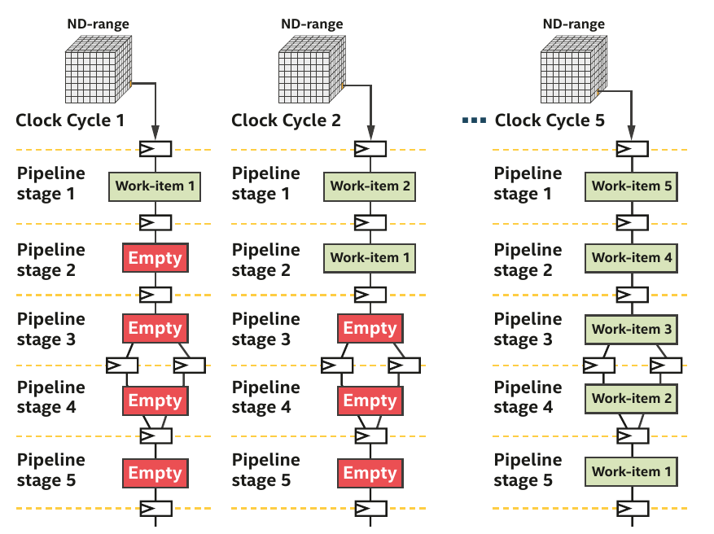

# Developing SYCL programs for Intel® FPGA cards

## Anatomy of a SYCL program

[](https://www.khronos.org/files/sycl/sycl-2020-reference-guide.pdf)

## Data Management
In the context of SYCL, Unified Shared Memory (USM) and buffers represent two different ways to handle memory and data management. They offer different levels of abstraction and ease of use, and the choice between them may depend on the specific needs of an application. Here's a breakdown of the differences:

### Unified Shared Memory (USM)

Unified Shared Memory is a feature that simplifies memory management by providing a shared memory space across the host and various devices, like CPUs, GPUs, and FPGAs. USM provides three different types of allocations:

1. **Device Allocations**: Allocated memory is accessible only by the device.
2. **Host Allocations**: Allocated memory is accessible by the host and can be accessed by devices. However, the allocated memory is stored on the host global memory. 
3. **Shared Allocations**: Allocated memory is accessible by both the host and devices. The allocated memory is present in both global memories and it is synchronized between host and device.

USM allows for more straightforward coding, akin to standard C++ memory management, and may lead to code that is easier to write and maintain. 

!!! warning "FPGA support"
    SYCL USM host allocations are only supported by some BSPs, such as the Intel® FPGA Programmable Acceleration Card (PAC) D5005 (previously known as Intel® FPGA Programmable Acceleration Card (PAC) with Intel® Stratix® 10 SX FPGA). Check with your BSP vendor to see if they support SYCL USM host allocations.

Using SYCL, you can verify if you have access to the different features:

!!! example "Verify USM capabilities"
    ```cpp
    if (!device.has(sycl::aspect::usm_shared_allocations)) {
        # Try to default to host allocation only
        if (!device.has(sycl::aspect::usm_host_allocations)) {
            # Default to device and explicit data movement
            std::array<int,N> host_array;
            int *my_array = malloc_device<int>(N, Q);
        }else{
            # Ok my_array is located on host memory but transferred to device as needed
            int* my_array = malloc_host<int>(N, Q);
        }
    }else{
            # Ok my_array is located on both global memories and synchronized automatically 
            int* shared_array = malloc_shared<int>(N, Q);
    }
    ```
!!! warning "That's not all"
    * Concurrent accesses and atomic modificationes are not necessarily available even if you have host and shared capabilities.
    * You need to verify `aspect::usm_atomic_shared_allocations` and `aspect::usm_atomic_host_allocations`.

!!! warning "Bittware 520N-MX"
    The USM host allocations is not supported by some BSPs. We will therefore use explicit data movement

!!! tip "Explicit USM"
    === "Question"
        * Go to the `GettingStarted/fpga_compile/part4_dpcpp_lambda_buffers/src`
        * Replace the original code with explicit USM code 
        * Verify your code using emulation

    === "Solution"
        ```cpp linenums="1"
        #include <iostream>
        // oneAPI headers
        #include <sycl/ext/intel/fpga_extensions.hpp>
        #include <sycl/sycl.hpp>

        // Forward declare the kernel name in the global scope. This is an FPGA best
        // practice that reduces name mangling in the optimization reports.
        class VectorAddID;

        void VectorAdd(const int *vec_a_in, const int *vec_b_in, int *vec_c_out,
                       int len) {
          for (int idx = 0; idx < len; idx++) {
            int a_val = vec_a_in[idx];
            int b_val = vec_b_in[idx];
            int sum = a_val + b_val;
            vec_c_out[idx] = sum;
          }
        }

        constexpr int kVectSize = 256;

        int main() {
          bool passed = true;
          try {
            // Use compile-time macros to select either:
            //  - the FPGA emulator device (CPU emulation of the FPGA)
            //  - the FPGA device (a real FPGA)
            //  - the simulator device
            #if FPGA_SIMULATOR
                auto selector = sycl::ext::intel::fpga_simulator_selector_v;
            #elif FPGA_HARDWARE
                auto selector = sycl::ext::intel::fpga_selector_v;
            #else  // #if FPGA_EMULATOR
                auto selector = sycl::ext::intel::fpga_emulator_selector_v;
            #endif

            // create the device queue
            sycl::queue q(selector);

            // make sure the device supports USM host allocations
            auto device = q.get_device();

            std::cout << "Running on device: "
                      << device.get_info<sycl::info::device::name>().c_str()
                      << std::endl;

            // declare arrays and fill them
            int host_vec_a[kVectSize];
            int host_vec_b[kVectSize];
            int host_vec_c[kVectSize];
            int * vec_a = malloc_device<int>(kVectSize,q);
            int * vec_b = malloc_device<int>(kVectSize,q);
            int * vec_c = malloc_device<int>(kVectSize,q);
            for (int i = 0; i < kVectSize; i++) {
              host_vec_a[i] = i;
              host_vec_b[i] = (kVectSize - i);
            }

            std::cout << "add two vectors of size " << kVectSize << std::endl;
            
            q.memcpy(vec_a, host_vec_a, kVectSize * sizeof(int)).wait();
            q.memcpy(vec_b, host_vec_b, kVectSize * sizeof(int)).wait();


            q.single_task<VectorAddID>([=]() {
                VectorAdd(vec_a, vec_b, vec_c, kVectSize);
              }).wait();

            q.memcpy(host_vec_c, vec_c, kVectSize * sizeof(int)).wait();

            // verify that VC is correct
            for (int i = 0; i < kVectSize; i++) {
              int expected = host_vec_a[i] + host_vec_b[i];
              if (host_vec_c[i] != expected) {
                std::cout << "idx=" << i << ": result " << host_vec_c[i] << ", expected ("
                          << expected << ") A=" << host_vec_a[i] << " + B=" << host_vec_b[i]
                          << std::endl;
                passed = false;
              }
            }

            std::cout << (passed ? "PASSED" : "FAILED") << std::endl;

            sycl::free(vec_a,q);
            sycl::free(vec_b,q);
            sycl::free(vec_c,q);
          } catch (sycl::exception const &e) {
            // Catches exceptions in the host code.
            std::cerr << "Caught a SYCL host exception:\n" << e.what() << "\n";

            // Most likely the runtime couldn't find FPGA hardware!
            if (e.code().value() == CL_DEVICE_NOT_FOUND) {
              std::cerr << "If you are targeting an FPGA, please ensure that your "
                           "system has a correctly configured FPGA board.\n";
              std::cerr << "Run sys_check in the oneAPI root directory to verify.\n";
              std::cerr << "If you are targeting the FPGA emulator, compile with "
                           "-DFPGA_EMULATOR.\n";
            }
            std::terminate();
          }
          return passed ? EXIT_SUCCESS : EXIT_FAILURE;
        }
        ```

### Buffer & accessors

Buffers and accessors are key abstractions that enable memory management and data access across various types of devices like CPUs, GPUs, DSPs, etc.

1. **Buffers**:Buffers in SYCL are objects that represent a region of memory accessible by the runtime. They act as containers for data and provide a way to abstract the memory management across host and device memories. This allows for efficient data movement and optimization by the runtime, as it can manage the data movement between host and device memory transparently.

2. **Accessors**:Accessors provide a way to access the data inside buffers. They define the type of access (read, write, read-write) and can be used within kernels to read from or write to buffers.

!!! success "Advantage"
    Through the utilization of these accessors, the SYCL runtime examines the interactions with the buffers and constructs a dependency graph that maps the relationship between host and device functions. This enables the runtime to automatically orchestrate the transfer of data and the sequencing of kernel activities.

!!! example "Using Buffers and Accessors"
    ```cpp linenums="1"
        #include <array> 
        // oneAPI headers
        #include <sycl/ext/intel/fpga_extensions.hpp>
        #include <sycl/sycl.hpp>

        class Kernel;
        constexpr int N = 100;
        std::array<int,N> in_array;
        std::array<int,N> out_array;
        for (int i = 0 ; i <N; i++)
            in_array[i] = i+1;
        queue device_queue(sycl::ext::intel::fpga_selector_v);

        { // This one is very important to define the buffer scope
          // buffer<int, 1> in_device_buf(in.data(), in.size());
          // Or more convenient

          buffer in_device_buf(in_array);
          buffer out_device_buf(out_array);
          device_queue.submit([&](handler &h) {
            accessor in(in_device_buf, h, read_only);
            accessor out(out_device_buf, h, write_only, no_init);
            h.single_task<Kernel>([=]() { });
          };
        } 
        // Accessor going out of the scope
        // Data has been copied back !!!
    ```

!!! warning "What about memory accesses in FPGA ? "
    * For FPGAs, the access pattern, access width, and coalescing of memory accesses can significantly affect performance. You might want to make use of various attributes and pragmas specific to your compiler and FPGA to guide the compiler in optimizing memory accesses.
    * In order to use **Direct Memory Acces (DMA)**, you will need to setup proper data alignment or the offline compiler will output the following warnings:
    ```bash
    Running on device: p520_hpc_m210h_g3x16 : BittWare Stratix 10 MX OpenCL platform (aclbitt_s10mx_pcie0)
    add two vectors of size 256
    ** WARNING: [aclbitt_s10mx_pcie0] NOT using DMA to transfer 1024 bytes from host to device because of lack of alignment
    **                 host ptr (0xb60b350) and/or dev offset (0x400) is not aligned to 64 bytes
    ** WARNING: [aclbitt_s10mx_pcie0] NOT using DMA to transfer 1024 bytes from host to device because of lack of alignment
    **                 host ptr (0xb611910) and/or dev offset (0x800) is not aligned to 64 bytes
    ** WARNING: [aclbitt_s10mx_pcie0] NOT using DMA to transfer 1024 bytes from device to host because of lack of alignment
    **                 host ptr (0xb611d20) and/or dev offset (0xc00) is not aligned to 64 bytes
    ``` 
    * For example, you may need to replace:
    ```cpp
        int * vec_a = new int[kVectSize];
        int * vec_b = new int[kVectSize];
        int * vec_c = new int[kVectSize];
    ```
    by these ones:
    ```cpp
       int * vec_a = new(std::align_val_t{ 64 }) int[kVectSize];
       int * vec_b = new(std::align_val_t{ 64 }) int[kVectSize];
       int * vec_c = new(std::align_val_t{ 64 }) int[kVectSize]; 
    ```
    
## Queue

Contrary to OpenCL, queues in SYCL are out-of-order by default. Nonetheless, you can change this behavior you declare it in your code.

!!! example "In-order-queue"
    <div style="width: 70%; float: left">
    ```cpp
      ... 
      queue device_queue{sycl::ext::intel::fpga_selector_v,{property::queue::in_order()}};
      // Task A
      device_queue.submit([&](handler& h) {
            h.single_task<TaskA>([=]() { });
      });
      // Task B
      device_queue.submit([&](handler& h) {
            h.single_task<TaskB>([=]() { });
      });
      // Task C
      device_queue.submit([&](handler& h) {
            h.single_task<TaskC>([=]() { });
      }); 
      ...
    ```
    </div>
    <div style="width: 20%; float: right">
    ``` mermaid
    graph TD
    A[TaskA] --> B[TaskB];
    B[TaskB] --> C[TaskC];
    ```
    </div>


This behavior is not very useful nor flexible. Queue objects, by default, are out-of-order queues, except when they're constructed with the in-order queue property. Because of this, they must include mechanisms to arrange tasks that are sent to them. The way queues organize tasks is by allowing the user to notify the runtime about the dependencies that exist between these tasks. These dependencies can be described in two ways: either explicitly or implicitly, through the use of command groups.

A command group is a specific object that outlines a task and its dependencies. These groups are generally expressed as C++ lambdas and are handed over as arguments to the submit() method within a queue object. The single parameter within this lambda is a reference to a handler object, utilized inside the command group to define actions, generate accessors, and outline dependencies.


### Explicit dependencies

Like for OpenCL, you can manage dependencies explicitly using events. 

!!! example "Using events"
    <div style="width: 75%; float: left">
    ```cpp
      ... 
      queue device_queue{sycl::ext::intel::fpga_selector_v};
      // Task A
      auto event_A = device_queue.submit([&](handler &h) {
            h.single_task<TaskA>([=]() { });
      });
      event_A.wait();
      // Task B
      auto event_B = device_queue.submit([&](handler &h) {
            h.single_task<TaskB>([=]() { });
      });
      // Task C
      auto event_C = device_queue.submit([&](handler &h) {
            h.single_task<TaskC>([=]() { });
      });
      // Task D
      device_queue.submit([&](handler &h) {
      h.depends_on({event_B, event_C});
      h.parallel_for(N, [=](id<1> i) { /*...*/ });
      }).wait();
      ...
    ```
    </div>
    <div style="width: 25%; float: right">
    ``` mermaid
    graph TD
    A[TaskA] --> B[TaskB];
    A[TaskA] --> C[TaskC];
    B[TaskB] --> D[TaskD];
    C[TaskC] --> D[TaskD];
    ```
    </div>


* Explicit dependencies using events is relevant when you use USM since buffers make use of accessors to model data dependencies.
* They are three possibilities to declare a dependcies explicitely:
1. Calling the method `wait()` on the queue it-self
2. Calling the method `wait` on the event return by the queue after submitting a command
3. Calling the method `depends_on` of the handler object

### Implicit dependencies

* Implicit dependencies occurs when your are using buffer & accessor.
* Accessors have different access modes:

  1. **read_only**: The content of the buffer can only be accessed for reading. So the content will only be copied once to the device
  2. **write_only**: The content of the buffer can only be accessed for writing. The content of buffer is still copied from host to device before the kernel starts 
  3. **read_write**: The content of the buffer can be accessed for reading and writing.

You can add the `no_init` property to an accessor in `write_only` mode. This tells the runtime that the original data contains in the buffer can be ignored and don't need to be copied from host to device.

Implicit dependencies obey to three main patterns (see [DPC++ book](https://link.springer.com/book/10.1007/978-1-4842-5574-2)):

* **Read-after-Write  (RAW)** : occurs when some data modified by a kernel should be read by another kernel. 
* **Write-after-Read  (WAR)** : occurs when some data read by a kernel will be modified by another one
* **Write-after-Write (WAW)** : occurs when two kernels modified the same data

!!! tip "Implicit dependencies"
    === "Question"
         * By default without access mode, each accessor will be read_write inducing unnecessary copies.
         * Note also the first use of `host_accessor`. Why did we use it here ?
         * Modifiy the following code to take into account implicit dependencies.
         ```cpp linenums="1"
            constexpr int N = 100;
            queue Q;
            buffer<int> A{range{N}};
            buffer<int> B{range{N}};
            buffer<int> C{range{N}};
            Q.submit([&](handler &h) {
               accessor aA{A, h};
               accessor aB{B, h};
               accessor aC{C, h};
               h.single_task<Kernel1>([=]() { 
                  for(unsigned int i =0; i<N; i++)
                      aA[i] = 10;
                      aB[i] = 50;
                      aC[i] = 0;
               });
            });
            Q.submit([&](handler &h) {
                accessor aA{A, h};
                accessor aB{B, h};
                accessor aC{C, h};
                h.single_task<Kernel2>([=]() { 
                   for(unsigned int i =0; i<N; i++)
                      aC[i] += aA[i] + aB[i]; 
                 });
            });
            Q.submit([&](handler &h) {
                accessor aC{C, h};
                h.single_task<Kernel3>([=]() {
                  for(unsigned int i =0; i<N; i++)
                     aC[i]++; 
                });
            });
            host_accessor result{C};
         ```

    === "Solution"
        ```cpp linenums="1"
           constexpr int N = 100;
           queue Q;
           buffer<int> A{range{N}};
           buffer<int> B{range{N}};
           buffer<int> C{range{N}};
           Q.submit([&](handler &h) {
              accessor aA{A, h, write_only, no_init};
              accessor aB{B, h, write_only, no_init};
              accessor aC{C, h, write_only, no_init};
              h.single_task<Kernel1>([=]() { 
                 for(unsigned int i =0; i<N; i++)
                     aA[i] = 10;
                     aB[i] = 50;
                     aC[i] = 0;
              });
           });
           Q.submit([&](handler &h) {
               accessor aA{A, h, read_only};
               accessor aB{B, h, read_only};
               accessor aC{C, h, write_only};
               h.single_task<Kernel2>([=]() { 
                  for(unsigned int i =0; i<N; i++)
                     aC[i] += aA[i] + aB[i]; 
                });
           });
           Q.submit([&](handler &h) {
               accessor aC{C, h, write_only};
               h.single_task<Kernel3>([=]() {
                 for(unsigned int i =0; i<N; i++)
                    aC[i]++; 
               });
           });
           host_accessor result{C, read_only};
        ```


## Parallelism model for FPGA

* FPGA strongly differs from ISA-based hardware such as CPU and GPU

!!! note "Difference between **Instruction Set** architecture and **Spatial** architecture"
    === "Instruction Set Architecture"
        * Made for general-purpose computation: hardware is constantly reused 
        * Workflow constrained by a set of pre-defined units (Control Units, ALUs, registers)
        * Data/Register size are fixed
        * Different instruction executed in each clock cycle : **temporal** execution  
        

    === "Spatial Architecture"
        * Keep only what it needs -- the hardware can be reconfigured
        * Specialize the everything by unrolling the hardware: **spatial** execution
        * Each operation uses a different hardware region
        * The design can take more space than the FPGA offers 

        { width=90% }

* The most obvious source of **parallelism** for FPGA is **pipelining** by inserting registers to store each operation output and keep all hardware unit busy. 

* Pipelining parallelism has therefore many stages. 

* If you don't have enough work to fill the pipeline, then the efficiency is very low.

* The authors of the [DPC++ book](https://link.springer.com/book/10.1007/978-1-4842-5574-2) have illustrated it perfectly in Chapter 17.

!!! note "Pipelining example provided chap.17 (DPC++ book)"
    === "Processing a single element (Figure. 17-13)"
        

        * The pipeline is mostly empty.
        * Hardware units are not busy and the efficiency is thus low.
            

    === "Taking advantage of pipelining (Figure 17-14)"
        

        * More data than stages, the pipeline is full and all hardware units are busy.

!!! warning "Vectorization"
    Vectorization is not the main source of parallelism but help designing efficient pipeline. Since hardware can be reconfigured at will. The offline compiler can design N-bits Adders, multipliers which simplify greatly vectorization. In fact, the offline compiler vectorizes your design automatically if possible.

### Pipelining with ND-range kernels

* ND-range kernels are based on a hierachical grouping of work-items
* A work-item represents a single unit of work 
* Independent simple units of work don't communicate or share data very often
* Useful when porting a GPU kernel to FPGA

<figure markdown>
 
  <figcaption><a href=https://link.springer.com/book/10.1007/978-1-4842-5574-2>DPC++ book</a> -- Figure 17-15 </figcaption>
</figure>

* FPGAs are different from GPU (lots of thread started at the same time)
* Impossible to replicate a hardware for a million of work-items
* Work-items are injected into the pipeline
* A deep pipeline means lots of work-items executing different tasks in parallel

<figure markdown>

  <figcaption><a href=https://link.springer.com/book/10.1007/978-1-4842-5574-2>DPC++ book</a> -- Figure 17-16 </figcaption>
</figure>

* In order to write basic data-parallel kernel, you will need to use the `parallel_for` method. Below is an example of simple data-parallel kernel. As you can notice it, there is no notion of groups nor sub-groups. 

!!! example "Matrix addition"
    ```cpp linenums="1"
       constexpr int N = 2048;
       constexpr int M = 1024;
       queue.submit([&](sycl::handler &h) {
         sycl::accessor acc_a{buffer_a, h, sycl::read_only};
         sycl::accessor acc_b{buffer_b, h, sycl::read_only};
         sycl::accessor acc_c{buffer_c, h, sycl::read_write, sycl::no_init};
         h.parallel_for(range{N, M}, [=](sycl::id<2> idx) {
          acc_c[idx] = acc_a[idx] + acc_b[idx];
         });
       });
    ```


!!! tip "Vector addition"
    === "Question"
        * Go to the `GettingStarted/fpga_compile/part4_dpcpp_lambda_buffers/src`
        * Adapt the `vector_add.cpp` single-task kernel to a basis data-parallel kernel
        * Emulate to verify your design
    
    === "Solution"
        ```cpp linenums="1"
        #include <iostream>
        // oneAPI headers
        #include <sycl/ext/intel/fpga_extensions.hpp>
        #include <sycl/sycl.hpp>

        // Forward declare the kernel name in the global scope. This is an FPGA best
        // practice that reduces name mangling in the optimization reports.
        class VectorAddID;

        constexpr int kVectSize = 256;

        int main() {
        bool passed = true;
          try {
            // Use compile-time macros to select either:
            //  - the FPGA emulator device (CPU emulation of the FPGA)
            //  - the FPGA device (a real FPGA)
            //  - the simulator device
            #if FPGA_SIMULATOR
                auto selector = sycl::ext::intel::fpga_simulator_selector_v;
            #elif FPGA_HARDWARE
                auto selector = sycl::ext::intel::fpga_selector_v;
            #else  // #if FPGA_EMULATOR
                auto selector = sycl::ext::intel::fpga_emulator_selector_v;
            #endif

            // create the device queue
            sycl::queue q(selector);

            // make sure the device supports USM host allocations
            auto device = q.get_device();

            std::cout << "Running on device: "
                      << device.get_info<sycl::info::device::name>().c_str()
                      << std::endl;

            // declare arrays and fill them
            int * vec_a = new(std::align_val_t{ 64 }) int[kVectSize];
            int * vec_b = new(std::align_val_t{ 64 }) int[kVectSize];
            int * vec_c = new(std::align_val_t{ 64 }) int[kVectSize];
            for (int i = 0; i < kVectSize; i++) {
              vec_a[i] = i;
              vec_b[i] = (kVectSize - i);
            }

            std::cout << "add two vectors of size " << kVectSize << std::endl;
            {
              // copy the input arrays to buffers to share with kernel
              sycl::buffer buffer_a{vec_a, sycl::range(kVectSize)};
              sycl::buffer buffer_b{vec_b, sycl::range(kVectSize)};
              sycl::buffer buffer_c{vec_c, sycl::range(kVectSize)};

              q.submit([&](sycl::handler &h) {
                // use accessors to interact with buffers from device code
                sycl::accessor accessor_a{buffer_a, h, sycl::read_only};
                sycl::accessor accessor_b{buffer_b, h, sycl::read_only};
                sycl::accessor accessor_c{buffer_c, h, sycl::write_only, sycl::no_init};

                h.parallel_for<VectorAddID>(sycl::range(kVectSize),[=](sycl::id<1> idx) {
        	  accessor_c[idx] = accessor_a[idx] + accessor_b[idx];
                });
              });
            }
            // result is copied back to host automatically when accessors go out of
            // scope.

            // verify that VC is correct
            for (int i = 0; i < kVectSize; i++) {
              int expected = vec_a[i] + vec_b[i];
              if (vec_c[i] != expected) {
                std::cout << "idx=" << i << ": result " << vec_c[i] << ", expected ("
                          << expected << ") A=" << vec_a[i] << " + B=" << vec_b[i]
                          << std::endl;
                passed = false;
              }
            }

            std::cout << (passed ? "PASSED" : "FAILED") << std::endl;

            delete[] vec_a;
            delete[] vec_b;
            delete[] vec_c;
          } catch (sycl::exception const &e) {
            // Catches exceptions in the host code.
            std::cerr << "Caught a SYCL host exception:\n" << e.what() << "\n";

            // Most likely the runtime couldn't find FPGA hardware!
            if (e.code().value() == CL_DEVICE_NOT_FOUND) {
              std::cerr << "If you are targeting an FPGA, please ensure that your "
                           "system has a correctly configured FPGA board.\n";
              std::cerr << "Run sys_check in the oneAPI root directory to verify.\n";
              std::cerr << "If you are targeting the FPGA emulator, compile with "
                           "-DFPGA_EMULATOR.\n";
            }
            std::terminate();
          }
          return passed ? EXIT_SUCCESS : EXIT_FAILURE;
        }
        ```

* If you want to have a fine-grained control of your data-parallel kernel, ND-range data-parallel kernels are the equivalent of ND-range kernels in OpenCL. 

!!! success "ND-range kernel in SYCL"
    * `nd_range(range<dimensions> globalSize, range<dimensions> localSize);`
    * ND-range kernels are defined with two range objects
        - **global** representing the total size of work-items
        - **local** representing the size of work-groups

!!! tip "Tiled Matrix Multiplication"
    === "Question"
        * Fill the blank and complete the code
         ```cpp linenums="1"
         --8<-- "./code/04-matmult_ndrange/src/matmult_ndrange_with_blank.cpp"
         ```
        

    === "Solution"
         ```cpp linenums="1"
         --8<-- "./code/04-matmult_ndrange/src/matmult_ndrange.cpp"
         ```

!!! warning "Warning on work-items group size"
    * If the attribute [[intel::max_work_group_size(Z, Y, X)]] is not specified in your kernel, the workgroup size assumes a default value depending on compilation time and runtime constraints
    * If your kernel contains a barrier, the Intel® oneAPI DPC++/C++ Compiler sets a default maximum scalarized work-group size of 128 work-items ==> without this attribute, the previous ND-Range kernel would have failed since we have a local work-group size of B x B = 256 work-items 


### Pipelining with single-work item (loop)

* When your code can't be decomposed into independent works, you can rely on loop parallelism using FPGA
* In such a situation, the pipeline inputs is not work-items but loop iterations
* For single-work-item kernels, the programmer need not do anything special to preserve the data dependency 
* Communications between kernels is also much easier

<figure markdown>

  <figcaption><a href=https://link.springer.com/book/10.1007/978-1-4842-5574-2>DPC++ book</a> -- Figure 17-21 </figcaption>
</figure>


* FPGA can efficiently handle loop execution, often maintaining a fully occupied pipeline or providing reports on what changes are necessary to enhance occupancy.
* It's evident that if loop iterations were substituted with work-items, where the value created by one work-item would have to be transferred to another for incremental computation, the algorithm's description would become far more complex.


!!! note "Single-work item creation"
    * Replace the `parallel_for`method by the `single_task` method defined in the handler class to create a single-work item kernel
    * The source file `vector_add.cpp` from `GettingStarted/fpga_compile/part4_dpcpp_lambda_buffers/src` uses loop pipelining.

    ```cpp linenums="1"
      #include <sycl/ext/intel/fpga_extensions.hpp>
      #include <sycl/sycl.hpp>

      using namespace sycl;

      int main(){


      // queue creation & data initialization


       q.submit([&](handler &h) {
         h.single_task<class MyKernel>([=]() {
           // Code to be executed as a single task
         });
       });
       q.wait();
      }
    ``` 

!!! tip "Inferring a shift register -- the accumulator case"
    === "Problem"
         * The following code sums double precision floating-point array
         * The problem is the following one:
           - For each loop iteration, the Intel® oneAPI DPC++/C++ Compiler takes >1 cycles to compute the result of the addition and then stores it in the variable temp_sum
           - So you have a data dependency on temp_sum
         ```cpp linenums="1"
         --8<-- "./code/05-accumulator/src/accumulator.cpp"
         ```
    === "Question" 
         * The following code rely on a shift register to relax the data dependency
         * Fill in the blank to complete the implementation
         ```cpp linenums="1"
         --8<-- "./code/06-shift_register/src/shift_register_with_blank.cpp"
         ```
    === "Solution" 
         ```cpp linenums="1"
         --8<-- "./code/06-shift_register/src/shift_register.cpp"
         ```

## Summary

!!! success "We have seen"
    * The anatomy of SYCL program
    * How to manage data movement between host and device for FPGA
        - Explicit data movement with USM
        - Implicit data movement with Buffers & accessors  
    * How to manage data dependencies between kernels
        - Explicit dependencies with events
        - Implicit dependencies using buffers access mode 
    * How to define kernels and the importance of pipelining in FPGA
        - ND-range kernel created with the `parallel_for` method
        - Single-work item kernel with the `single_task` method

!!! failure "We did not see"
    * Hierachical Parallels kernels
    * Memory models and atomics
    * The DPC++ Parallel STL


